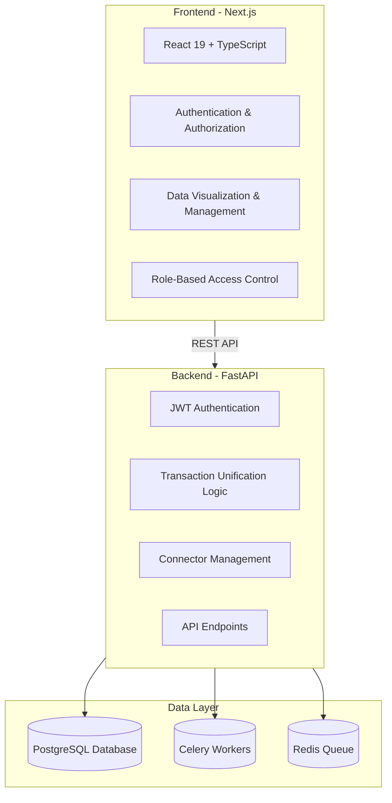

# 🧠 Retail Data Unification Platform
**Unified, Scalable, and Insight-Driven.**
A next-gen data platform that empowers businesses — from startups to enterprises — to analyze and unify their retail and e-commerce data **without needing a data engineering team**.

---

## 💡 Business Logic & Vision

Modern companies are drowning in fragmented data — Shopify sales, Amazon orders, Stripe transactions, Google Analytics metrics — all living in separate silos. Integrating and analyzing them requires data engineers, pipelines, ETL processes, and BI tools that most businesses can’t afford or maintain.

**Our platform solves this gap.**

It’s designed for **non-technical users** and **companies of all sizes** who want to:
- **Integrate** data from multiple e-commerce sources with a few clicks.
- **Unify and clean** it automatically with built-in normalization logic.
- **Query and analyze** it using **natural language**, instead of SQL or Python.
- **Visualize key business metrics** in seconds, without external tools.

The core idea:
> “Ask questions in plain English. Get unified insights instantly.”

Example:
> *“Show me top-selling products by region for Q3.”*
The system handles everything behind the scenes — data retrieval, cleaning, aggregation, and visualization.

---

## 🚀 Why It Matters

- **No-Code for Data** — anyone from a marketing manager to a CFO can use it.
- **Built for Scale** — cloud-native architecture supports startups and global enterprises alike.
- **Time-to-Insight** drops from days to minutes.
- **Lower Operational Costs** — no need to hire data engineers or maintain complex infrastructure.
- **Future-Proof** — modular architecture ready for AI copilots, predictive analytics, and automated decision-making.

# ⚙️ Architecture Diagram

# 🧩 Core Business Features

## 1. Data Unification Layer
Automatically maps, validates, and merges data from different marketplaces, ensuring a single consistent format.
**Value:** reduces integration friction and manual cleanup.

## 2. Natural Language Analysis
Uses AI-driven query parsing — users ask business questions in natural language.
**Value:** makes analytics accessible for non-technical roles.

## 3. Connector Ecosystem
Supports integrations with major platforms (Shopify, Amazon, WooCommerce, eBay, Stripe).
**Value:** immediate interoperability without custom scripts.

## 4. Scalable Cloud Architecture
Built to handle from **hundreds to millions of transactions** with async task queues and database optimization.
**Value:** growth-ready and cost-efficient.

## 5. Unified Dashboard
Provides interactive visualizations: revenue trends, conversion rates, churn analysis, and cohort metrics.
**Value:** instant insights without BI tools.

---

# 📈 Target Users

| Segment | Pain Point | How We Solve It |
|----------|-------------|----------------|
| **Small Businesses** | No data teams, manual reports | Plug-and-play analytics |
| **Mid-size Companies** | Too many data silos | Unified transaction database |
| **Enterprises** | Complex pipelines, slow insights | Scalable automation layer |
| **Non-technical Teams** | No SQL/ETL knowledge | Natural language queries |

# 🧠 Scalability Strategy

- **Containerized Infrastructure:** full Docker support for horizontal scaling.
- **Event-driven async pipeline:** Celery + Redis manage ingestion workloads efficiently.
- **PostgreSQL optimization:** schema designed for multi-tenant scaling.
- **Cloud-native deployment:** future-ready for Kubernetes orchestration.
- **Extensible connector SDK:** adding new data sources is as easy as creating a plugin.

# 💰 Monetization Model (Investor View)

- **Subscription Tiers** — based on data volume and team size.
- **Add-on Marketplace** — extra connectors, AI assistants, and industry-specific dashboards.
- **Enterprise Licensing** — white-label and on-premise deployments for larger clients.
